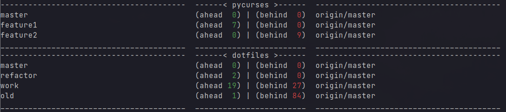

# gitmanager
## Script to manage multiple repos with multiple branches



### Install instructions
* Install with `make install` to install program and add manpage entry.

or

* run the bash script `gitmanager` directly.


### Emacs package install instructions
1. Doom Emacs
Add the following to you packages.el
``` emacs-lisp
(package! gitmanager :recipe (:host github :repo "nan0scho1ar/gitmanager" :files ("*.el")))
```

2. Add the following to you config.el
``` emacs-lisp
(use-package! gitmanager)
(after! gitmanager

  ;; Add one of the following repo sources

  ;; repo source option one  (Use same cache files as CLI tool)
  ;; (setq gitmanager-repo-source 'gitmanager-cache-file
  ;;       gitmanager-cache-dir "/home/your-username-here/.config/gitmanager/")

  ;; repo source option two  (Use projectile known projects)
  ;; (setq gitmanager-repo-source 'projectile)

  (map! :mode gitmanager-mode :n "RET" #'gitmanager-run-magit)
  (map! :mode gitmanager-mode :n "q" #'gitmanager-hide)
  (map! :mode gitmanager-mode :n "r" #'gitmanager-fetch-and-state)
  (map! :leader :desc "Open Gitmanager" "g m" #'gitmanager))
```

### CLI Usage
Before you can use any of the other commands you must cache the location of your repos.
This is accomplished with the `-F` (find) flag.
E.G. to recursively search you `$HOME` directory for git repositories use `gitmanager -F ~`
Once you have found some repos you may notice it has picked up some which you don't want to track.
These can be excluded by copying the path of these repos from `repos.cache` to `repos.exclude`.
These files can be found in `$XDG_CONFIG_HOME/gitmanager` (defaults to `~/.config/gitmanager` if variable unset).

### Command list
|Flag|Summary|Description|
--- | --- | ---
|-F|Search for git repos| Searches home directory for git repos (This must completed at least once to update the cache used by other functions)|
|-a|Branch auto| Automatically approves per branch confirmation prompts (To avoid pressing 'y' a bunch of times). Can be combined with -A|
|-A|Repo auto| Automatically approves per repo confirmation prompts (To avoid pressing 'y' a bunch of times). Can be combined with -a|
|-f|Fetch repos| Fetch and prune all repos|
|-s|Check for changes| Checks each repository for changes which have not been comitted and provides a simple summary|
|-S|List changes| List all changes in each repository which have not been comitted|
|-p|Pull| Prompts you to pull each branch in your git repositories|
|-P|Pull and push| Prompts you to pull+push each branch in your git repositories|
|-c|Add all changes + commit + push| Prompts you to add all changes + commit + push each git repository|
|-C|Add all changes + commit + push NO DIFF| Prompts you to add all changes + commit + push each git repository but will not prompt to show diff|
|-m|Merge origin/master into branches| Prompts you to merge origin/master into each branch in your git repositories|
|-M|Automerge origin/master into branches| Attempts to automatically merge origin/master into each branch in your git repositories|
|-r|Rebase branches| Prompts you to rebase into each branch onto origin/master for every repo in your git repositories|
|-R|Autorebase branches| Attempts to automatically rebase each branch onto origin/master for every repo in your git repositories|
|-e|Everything| Prompts you to add, commit, pull, push all branches of all repos|
|-E|Everything Auto| Attempts to automatically add, commit, pull, push all branches of all repos|
|-b master|   Compare master| Compares each branch in your git repositories against origin/master|
|-b clean|    Clean old branches| Prompts you to delete any branches in your git repositories which are 0 commits ahead of origin/master|
|-B master|   Compare master no fetch| Compares each branch in your git repositories against origin/master|
|-b remote|   Compare remote| Compares each branch in your git repositories against it's remote branch|
|-B remote|   Compare remote no fetch| Compares each branch in your git repositories against it's remote branch|
|--sync| Sync local and remote|Push and pull all branches of all repositories|
|-h --help|   Help| Displays this message|

### Breakdown
For a quick breakdown of the code/documentation check [gitmanager.org](gitmanager.org)

# Git Aliases #
## Aliases you might want to use from the .git_aliases file.
| alias  | description                                                                                                |
| ---    | ---                                                                                                        |
| ga     | git add (Add changes)                                                                                      |
| gaa    | git add all (Add all changes)                                                                              |
| gaf    | git add file (lists modified files in fzf and selected file will be added)                                 |
| guf    | git unstage file (lists modified files in fzf and selected file will be added)                             |
| ---    | ---                                                                                                        |
| gb     | git branch (List local branches)                                                                           |
| gba    | git branch all (List all branches)                                                                         |
| gbd    | git branch delete [name] (Deletes a branch)                                                                |
| gbdf   | git branch delete find (Opens banch list in fzf and deletes out the branch selected)                       |
| gbn    | git branch new [name] (Creates a new branch and checks it out)                                             |
| gbr    | git branch remote (Lists all of the branches you have authored on the remote)                              |
| ---    | ---                                                                                                        |
| gc     | git commit (commits staged changes)                                                                        |
| gcm    | git commit message (commits staged changes and prompts for commit message)                                 |
| gca    | git commit automatic (Commits staged changes with a very lazy automatic message)                           |
| ---    | ---                                                                                                        |
| gchk   | git checkout [name] (Checks out the branch with the supplied name)                                         |
| gchkf  | git checkout find (Opens branch list in fzf and checks out the branch selected)                            |
| gchkaf | git checkout all find (Opens branch list including remotes in fzf and checks out the branch selected)      |
| gchkn  | git checkout number [number] (Checks out the branch with the supplied number)                              |
| gchkm  | git checkout master (Checks out master)                                                                    |
| ---    | ---                                                                                                        |
| grh    | git reset head (Resets to head)                                                                            |
| grhh   | git reset head hard (Hard resets to head discarding all changes)                                           |
| grhs   | git reset head soft (Soft resets to head)                                                                  |
| grf    | git reset file (lists unstaged files in fzf and selected file will be reset to HEAD all changes discarded) |
| gclean | git clean (Removes untracked files)                                                                        |
| gfc    | git full clean (Removes untracked files and all changes)                                                   |
| ---    | ---                                                                                                        |
| gd     | git diff (Shows a diff of changes)                                                                         |
| gdf    | git diff file (lists unstaged files in fzf and a diff will be dispalyed for the selected file)             |
| gdn    | git diff name (Shows a diff of changes [name only])                                                        |
| gdnm   | git diff name master (Shows a diff of changes for master branch [name only])                               |
| gds    | git diff stat (Shows a diff of changes [name and line count])                                              |
| gdsm   | git diff stat master(Shows a diff of changes against master branch [name and line count])                  |
| ---    | ---                                                                                                        |
| gfo    | git fetch origin (Fetch info on branches from origin)                                                      |
| gfop   | git fetch origin prune (Fetch info on branches from origin and prune deleted)                              |
| ---    | ---                                                                                                        |
| gl     | git log (Show the git log)                                                                                 |
| glo    | git log oneline (Show the git log)                                                                         |
| glo    | git log oneline (Show the git log)                                                                         |
| gld    | git log decorated (Show the git log but fancy)                                                             |
| glm    | git log me (Show my commits in the git log)                                                                |
| glmc   | git log me compact (Show my commits in the git log compact form)                                           |
| ---    | ---                                                                                                        |
| gm     | git manage (Run git manage script)                                                                         |
| ---    | ---                                                                                                        |
| gma    | git merge abort (Aborts a git merge)                                                                       |
| gmt    | git merge test (Runs a test merge to see if there are any conflicts)                                       |
| gmc    | git merge conflicts (Opens conflict list in fzf then edits the selected file in vim)                       |
| gmom   | git merge origin/master (Merge origin/master into current branch)                                          |
| ---    | ---                                                                                                        |
| gpd    | git pull down (git pull)                                                                                   |
| gpu    | git push up (git push)                                                                                     |
| gpuf   | git push up force (Force push)                                                                             |
| gpuu   | git push up upstream (git push and set the upstream for the remote)                                        |
| ---    | ---                                                                                                        |
| gs     | git status (git status)                                                                                    |
| ---    | ---                                                                                                        |
| gsl    | git stash list (Lists the stashes)                                                                         |
| gsp    | git stash pop (Pops the stash)                                                                             |
| gss    | git stash show (Shows changes in the last stash)                                                           |
| ---    | ---                                                                                                        |
| gv     | git version (find prev version of file)                                                                    |
| ---    | ---                                                                                                        |
| gh     | git help (Displays this message)                                                                           |
